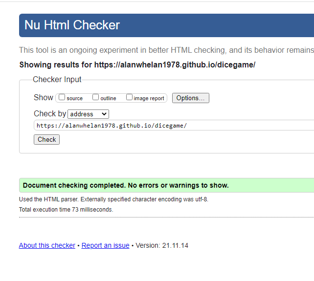
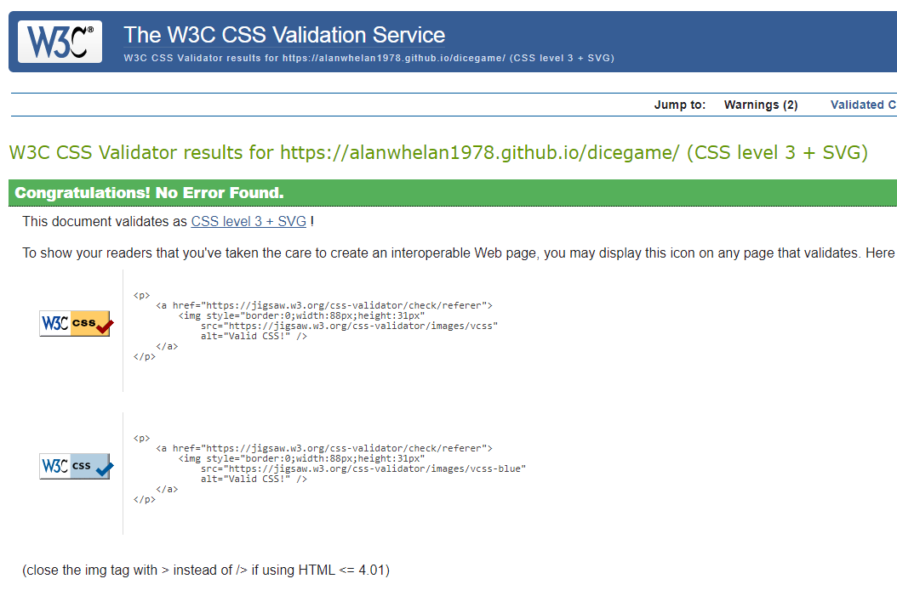

# Dice Game

[Link to live website](https://alanwhelan1978.github.io/dicegame/)

[Git Hub Repo](https://github.com/alanwhelan1978/dicegame)

This game is a simple addition & casino style game where the user has to complete addition questions and score under 21 to beat the computer. It was designed for my place of work to keep families entertained while they are waiting on a table for restaurant.

## Features

- The top of the body of the shows the hotel logo and the name of the game the user is playing.

### Game Area upper

- This area shows the user the dice and instructions on what they have to do.

### Game Area lower

- This is the controls area and allows the user to play the game by answering the addition question.

### Score Area

- once the users answers the question and its adds up up to 21 or under the user wins if the maths adds up to above 21 the computer win.

### Features left to impliment

- When my skill level increase I would like to add in actually rolling dice.
- I would also like to add a roulette version to the game also.

## Testing

- I tested playing this game in chrome, safari and firefox.

- I tested playing thi sgame on phone tablet and pc.

- I can confirm the game worked as planned.

- I can confirm the colors, font and imagery are easy to read and scored high on lighthouse through devolopment tools

## Bugs

### No bugs to report

## Validator testing

### HTML Testing

- I ran the project through the official W3C validator and no errors were found

### CSS Testing

- I ran the project through the official W3C validator and no errors were found

## DEPLOYMENT

-