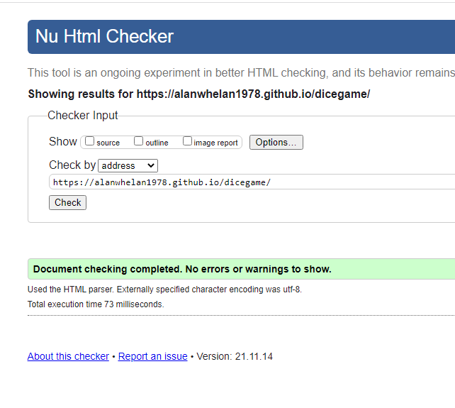
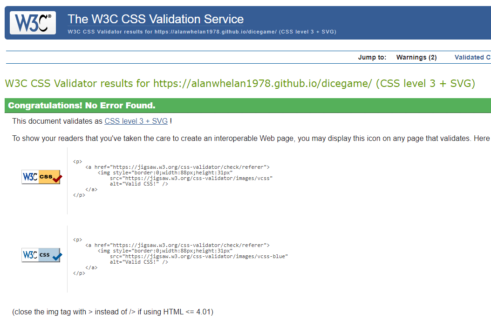
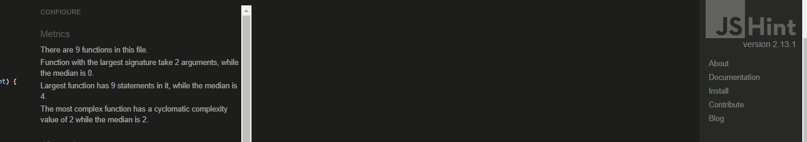

# Dice Game

[Link to live website](https://alanwhelan1978.github.io/dicegame/)

[Git Hub Repo](https://github.com/alanwhelan1978/dicegame)

This game is a simple addition & casino style game where the user has to complete addition questions and score under 21 to beat the computer. It was designed for my place of work to keep families entertained while they are waiting on a table for restaurant.

## Features

- The top of the body of the shows the hotel logo and the name of the game the user is playing.

### Game Area upper

- This area shows the user the dice and instructions on what they have to do.

### Game Area lower

- This is the controls area and allows the user to play the game by answering the addition question.

### Score Area

- once the users answers the question and its adds up up to 21 or under the user wins if the maths adds up to above 21 the computer win.

### Features left to impliment

- When my skill level increase I would like to add in actually rolling dice.
- I would also like to add a roulette version to the game also.

## Testing

- I tested playing this game in chrome, safari and firefox.

- I tested playing thi sgame on phone tablet and pc.

- I can confirm the game worked as planned.

- I can confirm the colors, font and imagery are easy to read and scored high on lighthouse through devolopment tools

## Bugs

### No bugs to report

## Validator testing

### HTML Testing

- I ran the project through the official W3C validator and no errors were found.

### CSS Testing

- I ran the project through the official W3C validator and no errors were found.

### JAVASCRIPT Testing

- I ran the project through JSHint and no errors were found.

## Languages Used

-   [HTML5](https://en.wikipedia.org/wiki/HTML5)
-   [CSS3](https://en.wikipedia.org/wiki/Cascading_Style_Sheets)
-   [JAVASCRIPT](https://en.wikipedia.org/wiki/JavaScript)

## DEPLOYMENT

### How this site was deployed

- In the GitHub repository, navigate to the Settings tab, then choose Pages from the left hand menu 
- From the source section drop-down menu, select the Master Branch
- Once the master branch has been selected, the page will be automatically refreshed with a detailed ribbon display to indicate the successful deployment
- Any changes pushed to the master branch will take effect on the live project

### How to clone the repository

- Go to the https://github.com/alanwhelan1978/dicegame repository on GitHub 
- Click the "Code" button to the right of the screen, click HTTPs and copy the link there
- Open a GitBash terminal and navigate to the directory where you want to locate the clone
- On the command line, type "git clone" then paste in the copied url and press the Enter key to begin the clone pr

# Credits

- Love Running & Love Maths projects
- Brian Macharia- Mentor support, guidance, tips, and key things to look out for throughout the project. Helping me to check for errors and looking at my code. 
- [HTML Validator](https://validator.w3.org/) - Testing validity of HTML.
- [CSS Validator](https://validator.w3.org/) -Testing validity of CSS.
- [Am I Responsive](http://ami.responsivedesign.is/#) - Checking the responsive nature.
- [Beautifer](https://beautifier.io/) - Allowing me beautify my code
- [Code Institute SampleREADME](https://github.com/Code-Institute-Solutions/SampleREADME)
- [Code Institute README Template](https://github.com/Code-Institute-Solutions/readme-template)
- [W3schools](https://www.w3schools.com/) - for various code information and trouble shooting.
- [Google fonts](https://fonts.google.com/) - CDN for the fonts were used in the project.
- [Pexel](https://pexels.com/) - Dice image
- [Canva](https://canva.com/) - Background imaes

***